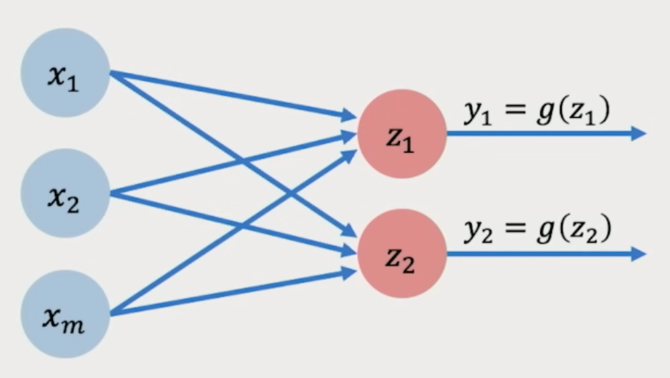

## [MIT - Introduction to Deep Learning - 2025](https://www.youtube.com/watch?v=alfdI7S6wCY)

### Definition
**Intelligence** is the ability to process information in order to inform some 
future decisions or actions.
> ...meaning take decisions or make actions based on information we've got.

👇👇👇\
**Artificial Intelligence** is the practice of building (artificial) algorithm 
to do the same process: use information, use data, to inform future decisions/actions.\
👇👇\
**Machine learning** is a subset of artificial intelligence that focuses on not 
explicitly programming the computer on how to use/process that data or information 
to inform that decision but just try to learn some patterns within the data to make 
those decisions.\
👇\
**Deep learning** is a subset of machine learning which focuses on doing that exact 
process with _deep neural networks_.
> Meaning teach computers how to learn a task directly from raw data

### Why deep learning?
Traditional **machine learning** typically defines a set of features.\
A **feature** is a set of rules which define how to do a task step by step; which is not
that easy, and even more complicated when it comes to robust features.

With **deep leaarning**, instead of defining these features, the key idea here is to let the system
get to these features automatically by observing the data.\
For example, when looking at faces, it can figure out step by step in a hierarchical way which 
patterns to detect first, without us explicitly telling it what those features are.

> So deep learning is a type of machine learning that uses artificial neural networks to learn from
data. These networks are inspired by the structure of the human brain and are able to learn complex 
patterns from large amounts of data. Deep learning is used in a wide range of applications, including
image recognition, natural language processing, and self-driving carts.


### Why now?
Even if deep learning techniques are decade olds, we're now experiencing an explosion of those 
techniques because of today's availability of big data (larger datasets, easier to collect and 
store,...), more powerful hardwares to compute (GPUs advent, massively parallelizable,...), and the evolution
of how we _deal_ with software (opensource toolboxes such as PyTorch and Tensorflow, improved 
techniques,...) that makes it very easy to get hand on the deep learning. 


### The perceptron—The structural (fundamental) building block of deep learning
A **perceptron (single neuron)** is the simplest type of artificial neuron: it takes inputs, 
multiplies them by weights, adds a bias, and then passes the result through an activation 
function to decide the output.
<p align="center"></p>

> Basically: inputs → weighted sum + bias → activation → output.

What leads us to the formula:  
<p align="center"></p>

Using vectors where the vector X is the collection of our inputs and the vector W, the
collection of our weights, we can simplify the formula of a perceptron to:
<p align="center">y = g(X.W + b)</p>

> Meaning that to pass information through a neuron, we take a dot product, apply a bias, and then 
apply a non-linearity

With `z = X.W + b`, we'll have `y = g(z)`.


#### Bias
It's a free number we add to the output of the weighted inputs in a perceptron.\
Without bias, `z = X.W` which is the line that must always pass through (0,0) (the origin).
That means no matter what weight w is, the line is stuck crossing that point. And this is a problem
because in real data, relationships between inputs and outputs don’t always pass through zero so
our neuron can't always rotate around the origin.

**E.g.:**
Let's imagine we want to model how much coffee we drink based on how many hours of sleep we missed.\
Here, Xs || Ws can be how many hours of sleep we missed while the second one will be how many coffees
that will be drunk.

Then, the Bias here will be equal to how many coffees we naturally drink in case of zero hour of 
missed sleep. 

👉 So in general: **bias** is the baseline output when all inputs are zero.


#### Activation Function G
The activation function G (like sigmoid, ReLU, tanh, etc.) decides the final output.\
it's the function that decides the output of a neuron by transforming its input into a useful 
signal by adding non-linearity so the network can learn complex patterns.

**Activation functions introduce non-linearity, which lets neural nets model things like language,
images, and decision boundaries.**

**E.g.:** Let's imagine we want to build a neural network to distinguish red points from green ones,
meaning we want, using a line, separate these red points from green ones:
<p align="center"></p>


With a linear function, we can only produce linear decisions no matter the size of the network,
meaning we can only draw a strict line (1st image). But non-linearity allows us to approximate 
arbitrarily complex function, so end up with such of line in the second image.
<p align="center"></p>

**Common activation functions:**
- Sigmoid function `g(z) = 1/(1+e^(-z))`, output between 0 and 1 so is good for probabilities. 
- Hyperbolic Tangent (tanh) function `g(z) = (e^z - e^(-z))/(e^z + e^(-z))`, output between -1 and 1, Historically used in RNNs (recurrent neural networks).
- Rectified Linear Unit (ReLU) function `g(z) = max(0, z)`, can suffer from “dying ReLU” (neurons stuck outputting 0)
- Leaky ReLU function `g(z) = x > 0 ? x : 0.01x`, fixes “dying ReLU” by allowing small negative outputs.


### Building Neural Networks with Perceptrons
First, let's simplify the schema of a neuron:
<p align="center"></p>

where as always:
<p align="center"></p>

So if we want to get multiple output neron networks, we only have to create a second perceptron, 
so we'll have two neurons instead of one. They will use the same inputs but **because their weights 
are different**, they'll produce two different outputs:
<p align="center"></p>

Where:
<p align="center"></p>

#### Layer
When you group multiple perceptrons working in parallel side by side on the same inputs, but each 
learning different weights, we get a **layer**. \
We talk about "**learning**" here because when we first create the neural network, each connection 
(weight) is just a random number. Then we show the network many examples (inputs and their correct 
outputs):
- The network makes a prediction with its current weights,
- compare the prediction to the correct answer, what gives error,
- then the network adjusts its weights a little bit to reduce that error, and again, and again,...

#### Dense Layer
When all inputs are densely connected to all outputs, these layers are called **Dense layers**.\
If you take your inputs and connect them to several neurons in parallel (each neuron producing 
one output), that whole thing is a layer.\
If there are 2 output neurons then, that’s a multi-output perceptron. But when generalized, 
we just call it a **dense layer with 2 units**.

#### Input layer
In big systems, the “inputs” might indeed be outputs of a previous model, so **input layer**.\
But even when they’re just raw features, many diagrams still label that column as the “input 
layer” for clarity of depth counting.

Inputs are often called _raw features_ because we actually have: 
> Raw data → (preprocess/encode) → Input features `x`

So when we say “inputs (features)”, it means the numeric input vector x the model 
consumes, which may be raw data (already numeric) or a numeric encoding of raw data.

### Single hidden layer neural network
<p align="center"></p>

To clearly pull out everything hidden here, let have a look at the formula of `Zi` and `Yi`:
<p align="center"></p>

So as shown by the formula, we have the first layer "**Inputs -> Hidden**" where:
- Each hidden neuron does a weighted sum + bias,
- Then we apply the activation function g(z),

So the hidden layer outputs are g(z_1), g(z_2),... Then we have the second layer "**Hidden → Outputs**"
which:
- start with those activated values g(z_j),
- do, using them, another weighted sum + bias,
- then we apply another activation function g to produce the final `y_1`, `y_2`.

So we talk about **hidden layer** because we don't directly observe the data that happens in this 
layer. 

With the **dense layers** simplified, our neural network will become:
<p align="center"></p>

Such of network can be implemented in python using 
- Tensorflow
```python
import tensorflow as tf
model = tf.keras.Sequential([
    tf.keras.layers.Dense(n), tf.keras.layers.Dense(2)
])
```
- Pytorch
```python
import torch as nn
model = nn.Sequential([
    nn.Linear(m, n), nn.ReLU(), nn.Linear(n, 2)
])
```

### Deep Neural Network
<p align="center"></p>

Where:
<p align="center"></p>


