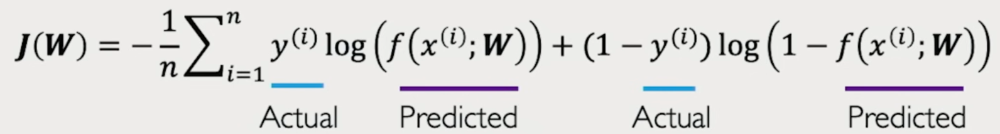

## [MIT - Introduction to Deep Learning - 2025](https://www.youtube.com/watch?v=alfdI7S6wCY)

### Definition

**Intelligence** is the ability to process information in order to inform some
future decisions or actions.

> ...meaning take decisions or make actions based on information we've got.

👇👇👇\
**Artificial Intelligence** is the practice of building (artificial) algorithm
to do the same process: use information, use data, to inform future decisions/actions.\
👇👇\
**Machine learning** is a subset of artificial intelligence that focuses on not
explicitly programming the computer on how to use/process that data or information
to inform that decision but just try to learn some patterns within the data to make
those decisions.\
👇\
**Deep learning** is a subset of machine learning which focuses on doing that exact
process with _deep neural networks_.

> Meaning teach computers how to learn a task directly from raw data

### Why deep learning?

Traditional **machine learning** typically defines a set of features.\
A **feature** is a set of rules which define how to do a task step by step; which is not
that easy, and even more complicated when it comes to robust features.

With **deep learning**, instead of defining these features, the key idea here is to let the system
get to these features automatically by observing the data.\
For example, when looking at faces, it can figure out step by step in a hierarchical way which
patterns to detect first, without us explicitly telling it what those features are.

> So deep learning is a type of machine learning that uses artificial neural networks to learn from
> data. These networks are inspired by the structure of the human brain and are able to learn complex
> patterns from large amounts of data. Deep learning is used in a wide range of applications, including
> image recognition, natural language processing, and self-driving carts.

### Why now?

Even if deep learning techniques are decade olds, we're now experiencing an explosion of those
techniques because of today's availability of big data (larger datasets, easier to collect and
store,...), more powerful pieces of hardware to compute (GPUs advent, massively parallelizable,...), and the evolution
of how we _deal_ with software (opensource toolboxes such as PyTorch and Tensorflow, improved
techniques,...) that makes it very easy to get hands on deep learning.

### The perceptron—The structural (fundamental) building block of deep learning

A **perceptron (single neuron)** is the simplest type of artificial neuron: it takes inputs,
multiplies them by weights, adds a bias, and then passes the result through an activation
function to decide the output.

<p align="center"></p>

> Basically: inputs → weighted sum + bias → activation → output.

What leads us to the formula:

<p align="center"></p>

Using vectors where the vector X is the collection of our inputs and the vector W, the
collection of our weights, we can simplify the formula of a perceptron to:

<p align="center">y = g(X.W + b)</p>

> Meaning that to pass information through a neuron, we take a dot product, apply a bias, and then
> apply a non-linearity

With `z = X.W + b`, we'll have `y = g(z)`.

#### Bias

It's a free number we add to the output of the weighted inputs in a perceptron.\
Without bias, `z = X.W` which is a line that must always pass through the origin (0,0).
That means no matter what weight `W` is, the line is stuck crossing that point. And this is a problem
because in real data, relationships between inputs and outputs don’t always pass through zero, so
our neuron can't always rotate around the origin.

**E.g.:**
Let's imagine we want to model how much coffee we drink based on how many hours of sleep we missed.\
Here, `Xs || Ws` can be how many hours of sleep we missed while the second one will be how many coffees
that will be drunk.

Then, the Bias here will be equal to how many coffees we naturally drink even in case of zero hour of
missed sleep.

> So in general: **bias** is the baseline output when all inputs are zero.

#### Activation Function G

The activation function G (like sigmoid, ReLU, tanh, etc.) decides the final output.\
it's the function that decides the output of a neuron by transforming its input into a useful
signal by adding non-linearity, so the network can learn complex patterns.

> Activation functions introduce non-linearity, which lets neural nets model things like language,
> images, and decision boundaries.

**E.g.:** Let's imagine we want to build a neural network to distinguish red points from green ones,
meaning we want, using a line, separate these red points from green ones:

<p align="center"></p>

With a linear function, we can only produce linear decisions no matter the size of the network,
meaning we can only draw a strict line (1st image). But non-linearity allows us to approximate
arbitrarily complex function, so end up with such of seperation in the second image.

<p align="center"></p>

**Common activation functions:**

- Sigmoid function `g(z) = 1/(1+e^(-z))`, produces output between 0 and 1 so is good for probabilities.
- Hyperbolic Tangent (tanh) function `g(z) = (e^z - e^(-z))/(e^z + e^(-z))`, produces output between -1 and 1, Historically used in RNNs (recurrent neural networks).
- Rectified Linear Unit (ReLU) function `g(z) = max(0, z)`, can suffer from “dying ReLU” (neurons stuck outputting 0)
- Leaky ReLU function `g(z) = z > 0 ? z : 0.01z`, fixes “dying ReLU” by allowing small negative outputs.

### Building Neural Networks with Perceptrons

First, let's simplify the schema of a neuron:

<p align="center"></p>

where as always:

<p align="center"></p>

If we want to get two outputs neron network, we only have to create a second perceptron,
so we'll have two neurons instead of one. They will use the same inputs but **because their weights
are different**, they'll produce two different outputs:

<p align="center"></p>

Where:

<p align="center"></p>

#### Layer

When you group multiple perceptrons working in parallel side by side on the same inputs, but each
learning different weights, we get a **layer**. \
We talk about "**learning**" here because when we first create the neural network, each connection
(weight) is just a random number. Then we show the network many examples (inputs and their correct
outputs):

- The network makes a prediction with its current weights,
- compare the prediction to the correct answer, what gives error,
- then the network adjusts its weights a little bit to reduce that error, and again, and again,...
  until it gets the correct output.

#### Dense Layer

When all inputs are densely connected to all outputs, these layers are called **Dense layers**.\
If you take your inputs and connect them to several neurons in parallel (each neuron producing
one output), that whole thing is a layer.\
If there are 2 output neurons then, that’s a multi-output perceptron. But when generalized,
we just call it a **dense layer with 2 units**.

#### Input layer

In big systems, the “inputs” might indeed be outputs of a previous model, so **input layer**.\
But even when they’re just raw features, many diagrams still label that column as the “input
layer” for clarity of depth counting.

Inputs are often called _raw features_ because we actually have:

> Raw data → (preprocess/encode) → Input features `X`

So when we say “inputs (features)”, it means the numeric input vector `X` the model
consumes, which may be raw data (already numeric) or a numeric encoding of the raw data.

### Single hidden layer neural network

<p align="center"></p>

To clearly pull out everything hidden here, let have a look at the formula of z<sub>i</sub> and y<sub>i</sub>:

<p align="center"></p>

As shown by the formula, we have the first layer "**Inputs -> Hidden**" where:

- Each hidden neuron does a weighted sum + bias,
- Then we apply the activation function g(z),

So the hidden layer outputs are g(z<sub>1</sub>), g(z<sub>2</sub>),...
Then we have the second layer "**Hidden → Outputs**"
which:

- start with those activated values g(z<sub>j</sub>),
- do, using them, another weighted sum + bias,
- then we apply another activation function g to produce the final output y<sub>1</sub>, y<sub>2</sub>.

> We talk about **hidden layer** because we don't directly observe the data that happens in this
> layer.

With the **dense layers** simplified, our neural network will become:

<p align="center"></p>

Such of network can be implemented in python using

- Tensorflow

```python
import tensorflow as tf
model = tf.keras.Sequential([
    tf.keras.layers.Dense(n),
    tf.keras.layers.Dense(2)
])
```

- Pytorch

```python
import torch as nn
model = nn.Sequential([
    nn.Linear(m, n),
    nn.ReLU(),
    nn.Linear(n, 2)
])
```

### Deep Neural Network

<p align="center"></p>

Here is a deep (multi-layer) dense network where:

<p align="center"></p>

Earlier layers learn simple features; deeper layers combine them into more abstract features.
The column labeled z<sub>k,1</sub>, z<sub>k,2</sub>, ..., z<sub>k,n_k</sub> is here, one hidden
layer’s feature vector.

Data flows through a chain of blocks, each doing `(W.X + b) → activation`, turning
inputs into increasingly useful features until the last block outputs y<sub>i</sub>.

**E.g.:** [testing/functional.py](./testing/functional.py).\
Let say that

- input size is n<sub>0</sub>=m;
- Hidden sizes are respectively n<sub>1</sub>,n<sub>2</sub>, ...,n<sub>L-1</sub>;
- And output size n<sub>L</sub>.

Example of values:

```python
m = 5   # input features (n0)
n1 = 8  # neurons in first hidden layer
n2 = 4  # neurons in second hidden layer
k = 2   # output classes
```

Using these values, here is the exact network will get:

<p align="center"></p>

Here is the functional API for the model training:

```python
from tensorflow import keras
from tensorflow.keras import layers

inputs  = keras.Input(shape=(m,), name="x")                       # input layer
h1      = layers.Dense(n1, activation="relu", name="L1")(inputs)  # hidden layer 1
h2      = layers.Dense(n2, activation="relu", name="L2")(h1)      # hidden layer 2
outputs = layers.Dense(k, activation="softmax", name="Out")(h2)   # output layer

model = keras.Model(inputs, outputs)
model.summary()
```

Sequential API (same thing, more compact):

```python
from tensorflow.keras import Sequential, layers

model = Sequential([
    layers.Input(shape=(m,)),               # x
    layers.Dense(n1, activation="relu"),    # h^(1)
    layers.Dense(n2, activation="relu"),    # h^(2) (z_{k,i})
    layers.Dense(k,  activation="softmax")  # ŷ
])
model.summary()
```

- We use ReLU in hidden layers because fast, simple, and helps gradients flow (good default for
  dense nets).
- Softmax in the last layer: turns the final scores into a probability distribution across classes
  (sums to 1) — perfect for multi-class classification.

#### Hidden sizes

Hidden sizes control the model capacity:

- Bigger = more capacity (risk of overfitting, more compute).
- Smaller = less capacity (risk of underfitting).

Common (but optional) patterns:

- A "funnel" (e.g., 8 → 4) to compress information.
- Start small, increase until `validation accuracy/loss` stops improving.
- Set the last layer size to the number of outputs (here k=2).

#### [Loss](./loss.md)

It's a number that measures how bad the model’s predictions are.

- Higher loss = worse predictions.
- Lower loss = better predictions.

<p align="center"><i>L</i>(<i>f</i>(x<sup>i</sup>; <b>W</b>), y<sup>(i)</sup>)</p>

Where <i>f</i>(x<sup>i</sup>; <b>W</b>)</b> is the current prediction and <b>y<sup>(i)</sup></b>,
the expected output.

There two kinds of loss

- Training loss: computed on the training data (the examples the model learns from).
- Validation loss: computed on separate data the model never sees during training (to test if it
  generalizes).

The **empirical loss** measures the total loss over our entire dataset, the average penalty my
model pays across the whole training set:
<p align="center">J(W)=1/n(∑<sup>n</sup><sub>i=1</sub>(L(f(x(i);W),y(i)))</p>

We've got different type of losses.\
For example, for binary classification (yes/no), we use the **soft cross entropy loss**:
<p align="center"></p>

Instead, the **Mean squared error loss** can be used with regression models that output continuous 
real numbers:
<p align="center"></p>


### Computing Grandients
The gradient is a set of “slopes” that tells you, for each weight, whether to move it up or down (and by how much) to make the loss smaller.
> meaning that the gradient acts on each weight

**E.g.:**\
Let's suppose the loss depends on a single weight, then the loss `J(w) = (w-3)^2` for a target `y = 3`.\
The formula `J(w) = (w-3)^2` is obteined by simplifying the formula of `J(W)` using:
- only one parameter, then a sigle weight `w`
- only one training example, then `n = 1`
- a trivial model: a linear model with the input `x=1`, the prediction is then equal to the weight
- and applying the **squared-error losss** formular: `L(^y, y) = (^y - y)^2`

So at w = 5, the loss is `J(5) = (5-3)^2 = 4.`\
The gradient (here, just the slope) is the derivative: `dJ/dw = 2(w-3)`\
Meaning that at w=5, `dJ/dw = 2(w-3) = 2(5-3) = 4 > 0`\
`dJ/dw > 0` so to lower the loss, we'll decrese `w`:
<p align="center"></p>
<p align="center">w<sub>new</sub> = w<sub>old</sub> - n(J'(w))= w<sub>old</sub> - n(dJ/dw<sub>old</sub>)</p>
<p align="center"></p>
<p>For the learning rate n = 0.1, w<sub>new</sub> = 5 - 0.1(4) = 4.6</p>
<p>And with that, now the loss is J(4.6) = (4.6 - 3)^2 = 2.56 which is smaller than J(5) = 4.</p>

> 👆 That’s gradient descent in action.

Rule of thumb:
- Sign: positive slope → move weight down; negative slope → move up.
- Size: big slope → take a bigger correction (scaled by the learning rate n).

With many weights, the gradient is a list of slopes. For W(w1, w2, ...), 
<p align="center"></p>

And as we understood ealier, the gradient acts on each weight so we'll have to update all weights at once:
<p align="center"></p>

Modern libraries compute these slopes automatically using backpropagation (automatic differentiation).


#### Computing Grandients: Backpropagation
<p align="center"></p>

Given this simple neuron network, we want to compute the gradient `J(W)` at the end.\
Let's start by apply the chain rule to determinate how does a small change in one weight (`w2`) affect our 
the final loss: 
<p align="center"></p>

Applying the same chain rule to compute the grandient before `w2`, will give us:
<p align="center"></p>

Introducing z<sub>1</sub> as `^y` is function of z<sub>1</sub>, will give us:
<p align="center"></p>

This is a way of expending, going from the output and keep computing the iterative chain rule back and back,
that's why we talk about **backpropagation**.


#### How do we determinate the learning rate
<p align="center"></p>

Ealier, we used `n=0.1` but we could use `n=0.4` (hmmm... we can, but maybe not).


#### Setting the learning rate
- Setting minimum rates converges slowly and gets stucks in 'false' local minima (may not really be
the best minima):
<p align="center"></p>

- Setting large learning rates overshoot, became unstable and diverge:
<p align="center"></p>

- So the idea is to set the learning rate not too small so it can converge smoothly while scaping 
local minima
<p align="center"></p>

And doing this can be by trying a lot of different learning rates and see what works "just right".
Or even doing better: design an adaptive algorith, adaptive learning rate that "adapts" to 
the landscape itself.
> meaning that the learning rate will increase or decrease as function of 
- how large the gradient is, 
- how fast the learning is happening,
- the size of particular weights
- etc,...

We have multiple adaptives (optimizer) wie can use such as Adam, Adadelta, Adagrad, RMSProp, 
SGB (Stochastic Gradient Descent Algorith, a grandient descent compute over a mini-batch 
(stochastic selection) instead of our whole dataset),...

#### Epoch, Batch

Epoch is one full pass through the entire training dataset during the training.\
**E.g.:**\
Giving 10,000 training examples. One epoch means the model has seen all 10,000 examples once
(possibly in mini-batches).

Training typically runs for multiple epochs, so the model sees the same data many times, gradually
improving its weights.
However, training doesn’t usually feed the entire dataset at once (that wouldn’t fit in memory).
Instead, we split it into **mini-batches**, a small subset of the data processed in one go (e.g.,
32 samples).\
That set of mini-batches (32 samples for example) lead to fast training as we can parallelize the 
gradient computation, achieve significat speed increases on GPU's.

**Iteration/Step:** one parameter/weight update after processing a single batch.

##### Concrete example

- N = 1,000 samples, batch size B = 100.
- Steps per epoch = N/B = 1000/100 = 10.
- If you train for 5 epochs, total steps = 10 x 5 = 50 total steps = 50 parameter updates.

#### What happens during an epoch?

- Shuffle (usually): Before each epoch, the training data is often shuffled so the model doesn’t
  see examples in the same order every time, the model don't meet a same batch twice (helps
  generalization).
- Loop over batches: For each batch:
  - Forward pass → compute predictions.
  - Compute loss (how wrong the predictions are).
  - Backpropagate gradients.
  - Update weights (one “step”/iteration).
- End of epoch:
  - Optionally evaluate on the validation set to get validation loss/accuracy.
  - Callbacks may trigger (e.g., EarlyStopping, ReduceLROnPlateau).
  - Learning-rate schedules may update at the epoch boundary.

We keep traking those metrics (prediction, loss,...) per epoch because they give a clean, big-picture
curve of training loss and validation loss/accuracy over time. And its where we detect phenomena
like overfitting and underfitting.

#### Overfitting and Underfitting

- **Overfitting**: as epochs go by, the training loss goes down, and the validation loss goes up
  (low training loss, high validation loss) → meaning that the model is memorizing the training data
  while failing on new data.\
  How to fix it: Simplify the model (fewer layers/units), Regularize, More/augmented data (flip/rotate
  images, etc.).

- **Underfitting**: high training and validation loss → meaning that the model is too simple/not
  trained enough, not learning enough patterns. 
  1. Bigger model (more units/layers). 
  2. Train longer (more epochs). 
  3. Reduce regularization (lower dropout/L2). 
  4. Slightly higher learning rate (so it can learn faster), if it’s too small.
<p align="center"></p>

#### Regularization
It's a technique that help to discourage the complex model memorization protocol in case we have a 
small dataset and a big model (complex model) in order to improve the generalization of our model
on unseen data.\
We have different type of regularization techniques such as:
- Dropout: during the training, ramdomly set some activations of our hidden neurons to 0. We do this
on typically 50% of our activations in layer. This force the network to not rely on any `i` node.
<p align="center"></p>

With this, even seen the same data twice will not let the model memorize as we adding, thanks to 
the dropout, another level of stochasticity. And even the dropout nodes are not already the same one:
<p align="center"></p>

- Early stopping: basically, we stop the model training before we have a chance to overfit:
<p align="center"></p>


